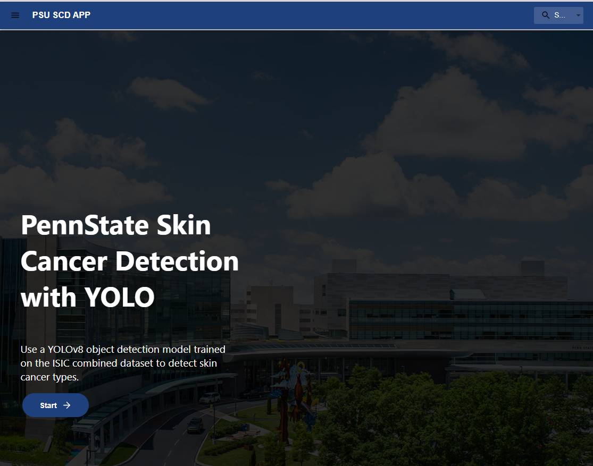

# SkinWebApp
This is PWA created for Skin Cancer Detection Project

Derived from: https://github.com/jinyoonok2/Skin-Cancer-Detection-Capstone/tree/main

After you clone the repository, follow the commands to install the packages and then run the program.
```markdown
npm install
```
then
```markdown
npm run
```

# Interface Examples


